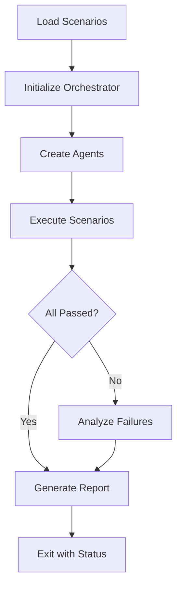

# Quick Reference: Gadugi E2E Test Suite

## Quick Start

```bash
# Build the framework
npm install
npm run build

# Run smoke test
node dist/cli.js run -s e2e-smoke-test -d scenarios

# Run specific E2E scenario
node dist/cli.js run -s e2e-tui-session-management -d scenarios

# Run all E2E tests
node e2e-test-runner.ts
```

## Test Scenarios Overview

| Scenario | File | Steps | Focus Area |
|----------|------|-------|------------|
| **TUI Session Management** | `e2e-tui-session-management.yaml` | 11 | PATH inheritance, session detection |
| **Scenario Adapter** | `e2e-scenario-adapter-validation.yaml` | 14 | Defensive programming, YAML parsing |
| **Orchestrator** | `e2e-orchestrator-coordination.yaml` | 6 | Multi-agent coordination, error handling |
| **CLI Interactive** | `e2e-cli-interactive-sessions.yaml` | 14 | CLI session handling, process management |
| **TUI Color Parsing** | `e2e-tui-color-parsing.yaml` | 15 | ANSI colors, terminal formatting |
| **Smoke Test** | `e2e-smoke-test.yaml` | 3 | Basic framework validation |

## Git Commits Tested

| Commit | Description | Test Scenario |
|--------|-------------|---------------|
| `16d1d3a` | TUIAgent inherit PATH | TUI Session Management |
| `4176911` | TUIAgent auto-detect session | TUI Session Management |
| `c5d89b3` | getMostRecentSessionId | TUI Session Management |
| `b6d3901` | Defensive checks | Scenario Adapter |
| `554a511` | Handle undefined steps | Scenario Adapter |
| `fdd995e` | YAML parsing fixes | Scenario Adapter |
| `69c8de6` | runWithScenarios method | Orchestrator |
| `ab2b5cf` | Remove type casts | Orchestrator |
| `9844af6` | Actual orchestrator.run() | Orchestrator |

## Test Statistics

- **Total Scenarios**: 6 (5 E2E + 1 smoke)
- **Total Test Steps**: 63
- **Lines of Test Code**: ~43 KB YAML + 13 KB TypeScript
- **Recent Fixes Covered**: 9 commits
- **Documentation**: 20+ KB

## Key Features Tested

### ✅ Tested
- TUI terminal spawning and session management
- PATH environment variable inheritance
- Session auto-detection and explicit targeting
- YAML scenario parsing with error handling
- Defensive programming for invalid inputs
- Multi-agent orchestration
- Pre-loaded scenario execution
- CLI command execution (various modes)
- Interactive sessions with stdin/stdout
- Process timeout and cleanup
- ANSI color code parsing
- Terminal output formatting detection
- Error handling without type casts

### 📋 To Be Tested (Future)
- Electron UI agent integration
- WebSocket monitoring
- Visual regression (screenshot comparison)
- Performance benchmarks
- Network failure simulation
- Large-scale multi-agent scenarios
- node-pty specific features

## Common Commands

```bash
# Validate YAML syntax
node -e "const yaml = require('js-yaml'); const fs = require('fs'); console.log(yaml.load(fs.readFileSync('scenarios/e2e-tui-session-management.yaml')))"

# Check test scenario count
ls -1 scenarios/e2e-*.yaml | wc -l

# Run with debug logging
node dist/cli.js run -s e2e-smoke-test -d scenarios --log-level debug

# Generate test report
node e2e-test-runner.ts > test-output.log 2>&1
```

## Troubleshooting

### Build Issues
```bash
# If tsc not found
npm install

# If build fails
rm -rf dist node_modules
npm install
npm run build
```

### Test Failures
```bash
# Check session output
cat outputs/sessions/session_*.json

# Verify action names
grep -r "action:" scenarios/e2e-*.yaml

# Test individual step
node dist/cli.js run -s e2e-smoke-test -d scenarios
```

### YAML Validation
```bash
# Check for duplicate keys (common issue)
grep -n "output_contains:" scenarios/e2e-*.yaml

# Validate YAML structure
yamllint scenarios/e2e-*.yaml  # if yamllint installed
```

## Integration with CI/CD

### GitHub Actions Example
```yaml
- name: Run E2E Tests
  run: |
    npm install
    npm run build
    node e2e-test-runner.ts
  env:
    NODE_ENV: test
```

### Exit Codes
- `0` - All tests passed
- `1` - One or more tests failed
- `2` - Configuration error

## File Locations

```
gadugi-agentic-test/
├── scenarios/
│   ├── e2e-tui-session-management.yaml       # Test 1
│   ├── e2e-scenario-adapter-validation.yaml   # Test 2
│   ├── e2e-orchestrator-coordination.yaml     # Test 3
│   ├── e2e-cli-interactive-sessions.yaml      # Test 4
│   ├── e2e-tui-color-parsing.yaml            # Test 5
│   └── e2e-smoke-test.yaml                   # Smoke test
├── e2e-test-runner.ts                        # Main runner
├── simple-e2e-executor.js                    # Simple executor
├── E2E_TESTS_README.md                       # Full documentation
└── E2E_TEST_IMPLEMENTATION_SUMMARY.md        # Implementation summary
```

## Test Execution Workflow



## Best Practices

1. **Run smoke test first** - Quick validation
2. **Use debug logging** - When investigating issues  
3. **Check session outputs** - For detailed failure info
4. **Validate YAML** - Before running tests
5. **Review commits** - Understand what each test validates
6. **Update tests** - When adding new features
7. **Document failures** - Help future debugging

## Contact & Support

- **Repository**: https://github.com/rysweet/gadugi-agentic-test
- **Issues**: Create GitHub issue with `e2e-tests` tag
- **Documentation**: See `E2E_TESTS_README.md`

---

**Last Updated**: 2026-02-22
**Test Suite Version**: 1.0.0
**Framework Version**: 1.0.0
