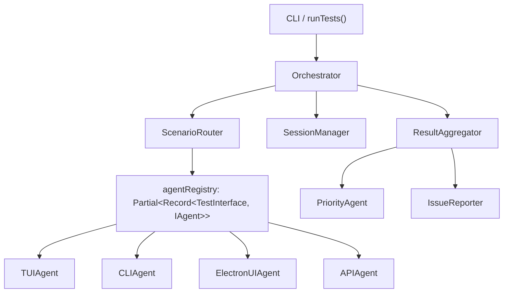
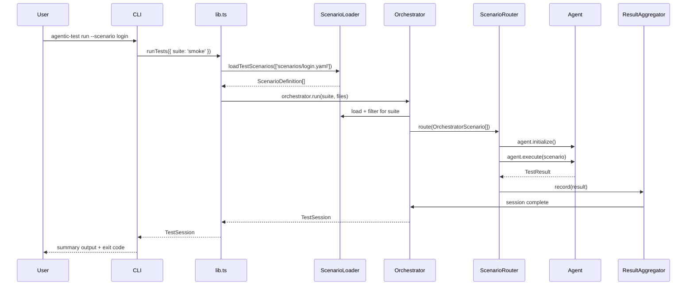

# Architecture — @gadugi/agentic-test

> **Type:** Explanation (Diataxis)
> **Updated:** 2026-02-22

## Contents

- [Overview](#overview)
- [Directory Structure](#directory-structure)
- [Agent Layer](#agent-layer)
- [Core Layer](#core-layer)
- [Runners](#runners)
- [Orchestrator](#orchestrator)
- [Utils](#utils)
- [Models](#models)
- [Programmatic API](#programmatic-api)
- [CLI](#cli)
- [BaseAgent Pattern](#baseagent-pattern)
- [Module Philosophy](#module-philosophy)
- [Data Flow](#data-flow)

---

## Overview

`@gadugi/agentic-test` is a layered, multi-agent testing framework for Electron and
TUI applications. Each layer has a single responsibility and depends only on layers
below it.

```
┌─────────────────────────────────────────┐
│  CLI  (src/cli.ts + src/cli/)           │  Entry point, Commander commands
├─────────────────────────────────────────┤
│  Programmatic API  (src/lib.ts)         │  Signal-handler-free runTests()
├─────────────────────────────────────────┤
│  Orchestrator  (src/orchestrator/)      │  Scenario routing, session, results
├─────────────────────────────────────────┤
│  Agents  (src/agents/)                  │  9 specialised test executors
├─────────────────────────────────────────┤
│  Runners  (src/runners/)                │  UI test runners (Electron/Playwright)
├─────────────────────────────────────────┤
│  Core  (src/core/)                      │  PTY, processes, waiting, resources
├─────────────────────────────────────────┤
│  Utils  (src/utils/)                    │  Logging, config, retry, screenshots
├─────────────────────────────────────────┤
│  Models  (src/models/)                  │  Data types shared across all layers
└─────────────────────────────────────────┘
```

---

## Directory Structure

```
src/
├── index.ts                   # Full public API re-export
├── lib.ts                     # Programmatic API (no process side-effects)
├── lib/
│   ├── ConfigurationLoader.ts # Default config factory + file loading
│   ├── ScenarioLoader.ts      # YAML scenario discovery + suite filtering
│   └── ResultsHandler.ts      # Result persistence + display + dry-run
├── cli.ts                     # CLI entry point (Commander)
├── cli-path-utils.ts          # Path traversal guard for CLI flags
├── cli/
│   ├── output.ts              # Shared print helpers (logSuccess, logError…)
│   └── commands/
│       ├── run.ts             # agentic-test run
│       ├── watch.ts           # agentic-test watch
│       ├── validate.ts        # agentic-test validate
│       ├── list.ts            # agentic-test list
│       ├── init.ts            # agentic-test init
│       ├── init-templates.ts  # Scenario template generator
│       └── help.ts            # agentic-test help
├── agents/
│   ├── index.ts               # IAgent interface, AgentType enum, all exports
│   ├── BaseAgent.ts           # Abstract base — shared execute() loop
│   ├── TUIAgent.ts            # Terminal-UI test execution
│   ├── CLIAgent.ts            # CLI subprocess testing
│   ├── APIAgent.ts            # HTTP/REST API testing
│   ├── WebSocketAgent.ts      # WebSocket protocol testing
│   ├── ElectronUIAgent.ts     # Electron app UI testing
│   ├── ComprehensionAgent.ts  # LLM-powered feature discovery
│   ├── IssueReporter.ts       # GitHub issue creation
│   ├── PriorityAgent.ts       # Test prioritisation
│   ├── SystemAgent.ts         # System resource monitoring
│   ├── tui/                   # TUIAgent sub-modules
│   │   ├── TUIInputSimulator.ts
│   │   ├── TUIMenuNavigator.ts
│   │   ├── TUIOutputParser.ts
│   │   ├── TUISessionManager.ts
│   │   ├── TUIStepDispatcher.ts
│   │   ├── types.ts
│   │   └── index.ts
│   ├── cli/                   # CLIAgent sub-modules
│   │   ├── CLICommandRunner.ts
│   │   ├── CLIOutputParser.ts
│   │   ├── types.ts
│   │   └── index.ts
│   ├── api/                   # APIAgent sub-modules
│   │   ├── APIAuthHandler.ts
│   │   ├── APIRequestExecutor.ts
│   │   ├── APIResponseValidator.ts
│   │   ├── types.ts
│   │   └── index.ts
│   ├── websocket/             # WebSocketAgent sub-modules
│   │   ├── WebSocketConnection.ts
│   │   ├── WebSocketEventRecorder.ts
│   │   ├── WebSocketMessageHandler.ts
│   │   ├── WebSocketStepExecutor.ts
│   │   ├── types.ts
│   │   └── index.ts
│   ├── electron/              # ElectronUIAgent sub-modules
│   │   ├── ElectronLauncher.ts
│   │   ├── ElectronPageInteractor.ts
│   │   ├── ElectronPerformanceMonitor.ts
│   │   ├── ElectronWebSocketMonitor.ts
│   │   ├── types.ts
│   │   └── index.ts
│   ├── comprehension/         # ComprehensionAgent sub-modules
│   │   ├── DocumentationLoader.ts
│   │   ├── OutputComprehender.ts
│   │   ├── ScenarioComprehender.ts
│   │   ├── types.ts
│   │   └── index.ts
│   ├── issue/                 # IssueReporter sub-modules
│   │   ├── IssueDeduplicator.ts
│   │   ├── IssueFormatter.ts
│   │   ├── IssueSubmitter.ts
│   │   ├── types.ts
│   │   └── index.ts
│   ├── priority/              # PriorityAgent sub-modules
│   │   ├── PriorityAnalyzer.ts
│   │   ├── PriorityPatternExtractor.ts
│   │   ├── PriorityQueue.ts
│   │   ├── types.ts
│   │   └── index.ts
│   ├── system/                # SystemAgent sub-modules
│   │   ├── MetricsCollector.ts
│   │   ├── DockerMonitor.ts
│   │   ├── FileSystemWatcher.ts
│   │   ├── SystemAnalyzer.ts
│   │   ├── types.ts
│   │   └── index.ts
│   └── examples/              # Runnable usage examples per agent
├── core/
│   ├── PtyTerminal.ts         # PTY process wrapper (node-pty)
│   ├── AdaptiveWaiter.ts      # Condition-based waiting + backoff
│   ├── ProcessLifecycleManager.ts  # Zombie-process prevention
│   ├── ResourceOptimizer.ts   # CPU/memory/concurrency optimisation
│   └── optimizer/             # ResourceOptimizer sub-modules
│       ├── ConcurrencyOptimizer.ts
│       ├── CpuOptimizer.ts
│       ├── MemoryOptimizer.ts
│       ├── types.ts
│       └── index.ts
├── orchestrator/
│   ├── TestOrchestrator.ts    # Thin facade: routes + sessions + results
│   ├── ScenarioRouter.ts      # Dispatches scenarios to agents (parallel)
│   ├── SessionManager.ts      # Session lifecycle and persistence
│   ├── ResultAggregator.ts    # Collects results, triggers analysis/reporting
│   ├── agentAdapters.ts       # Config shape adapters (UI/TUI/priority)
│   └── index.ts
├── runners/
│   ├── SmartUITestRunner.ts      # Playwright-based adaptive UI runner
│   ├── ComprehensiveUITestRunner.ts  # Exhaustive UI flow runner
│   ├── smart/
│   │   ├── SmartElementFinder.ts
│   │   ├── SmartInteractionExecutor.ts
│   │   └── index.ts
│   ├── comprehensive/
│   │   ├── UIFlowTester.ts
│   │   └── index.ts
│   └── index.ts
├── scenarios/
│   └── index.ts               # ScenarioDefinition schema + ScenarioLoader
├── adapters/
│   └── scenarioAdapter.ts     # ScenarioDefinition → OrchestratorScenario
├── models/
│   ├── TestModels.ts          # OrchestratorScenario, TestSession, TestResult
│   ├── Config.ts              # TestConfig (top-level config shape)
│   ├── AppState.ts            # Runtime application state
│   ├── TUIModels.ts           # TUI-specific model facade
│   ├── tui/
│   │   ├── TUIConfig.ts
│   │   ├── TUIResults.ts
│   │   ├── TUISession.ts
│   │   └── index.ts
│   └── index.ts
└── utils/
    ├── logger.ts              # Logger facade
    ├── config.ts              # Config utilities facade
    ├── fileUtils.ts           # File utilities facade
    ├── yamlParser.ts          # YAML parser facade
    ├── retry.ts               # Retry facade
    ├── async.ts               # delay() and async helpers
    ├── comparison.ts          # deepEqual() utility
    ├── colors.ts              # Terminal color helpers
    ├── ids.ts                 # ID generation
    ├── agentUtils.ts          # Shared agent utility functions
    ├── index.ts
    ├── logging/
    │   ├── LogFormatter.ts
    │   ├── LogTransport.ts
    │   └── index.ts
    ├── config/
    │   ├── ConfigLoader.ts
    │   ├── ConfigManager.ts
    │   ├── ConfigValidator.ts
    │   ├── types.ts
    │   └── index.ts
    ├── files/
    │   ├── FileArchiver.ts
    │   ├── FileReader.ts
    │   ├── FileSearch.ts
    │   ├── FileWriter.ts
    │   ├── types.ts
    │   └── index.ts
    ├── retry/
    │   ├── CircuitBreaker.ts
    │   ├── RetryExecutor.ts
    │   ├── types.ts
    │   └── index.ts
    ├── screenshot/
    │   ├── ScreenshotCapture.ts
    │   ├── ImageComparator.ts
    │   ├── DiffRenderer.ts
    │   ├── ScreenshotReporter.ts
    │   ├── types.ts
    │   └── index.ts
    └── yaml/
        ├── YamlLoader.ts
        ├── YamlValidator.ts
        ├── YamlVariableSubstitution.ts
        ├── types.ts
        └── index.ts
```

---

## Agent Layer

All nine agents implement the `IAgent<TScenario, TResult>` interface and extend
`BaseAgent`. Each agent is responsible for one execution domain.

```typescript
export interface IAgent<TScenario = unknown, TResult = unknown> {
  name: string;
  type: string;
  initialize(): Promise<void>;
  execute(scenario: TScenario): Promise<TResult>;
  cleanup(): Promise<void>;
}

export enum AgentType {
  UI          = 'ui',
  CLI         = 'cli',
  TUI         = 'tui',
  API         = 'api',
  WEBSOCKET   = 'websocket',
  GITHUB      = 'github',
  SYSTEM      = 'system',
  COMPREHENSION = 'comprehension',
  PRIORITY    = 'priority',
}
```

### TUIAgent — `src/agents/TUIAgent.ts`

Executes test scenarios against terminal-based (TUI) applications via a PTY session.
Uses `PtyTerminal` for PTY management, delegating input simulation, menu navigation,
output parsing, and step dispatch to focused sub-modules.

Sub-modules: `TUIInputSimulator`, `TUIMenuNavigator`, `TUIOutputParser`,
`TUISessionManager`, `TUIStepDispatcher`.

### CLIAgent — `src/agents/CLIAgent.ts`

Spawns CLI subprocesses and validates their output and exit codes. Handles streaming
stdout/stderr, environment variable injection (into the child process only — never
mutating `process.env`), and command history.

Sub-modules: `CLICommandRunner`, `CLIOutputParser`.

### APIAgent — `src/agents/APIAgent.ts`

Tests HTTP/REST APIs. Supports authentication (Bearer, Basic, API key), request and
response interceptors, JSON Schema validation, and performance measurement.

Sub-modules: `APIAuthHandler`, `APIRequestExecutor`, `APIResponseValidator`.

### WebSocketAgent — `src/agents/WebSocketAgent.ts`

Tests WebSocket connections: connection lifecycle, message send/receive, event
recording, and reconnection with configurable backoff.

Sub-modules: `WebSocketConnection`, `WebSocketEventRecorder`,
`WebSocketMessageHandler`, `WebSocketStepExecutor`.

### ElectronUIAgent — `src/agents/ElectronUIAgent.ts`

Drives Electron applications via Playwright. Handles app launch, page interaction,
performance sampling, and WebSocket monitoring (delegated to `WebSocketAgent`).

Sub-modules: `ElectronLauncher`, `ElectronPageInteractor`,
`ElectronPerformanceMonitor`, `ElectronWebSocketMonitor`.

### ComprehensionAgent — `src/agents/ComprehensionAgent.ts`

Uses an LLM (OpenAI-compatible) to discover and understand application features from
documentation and runtime output. Converts discoveries into structured `FeatureSpec`
objects.

Sub-modules: `DocumentationLoader`, `OutputComprehender`, `ScenarioComprehender`.

### IssueReporter — `src/agents/IssueReporter.ts`

Creates, deduplicates, and updates GitHub issues for test failures. Uses SHA-256
fingerprinting for deduplication. Applies an allowlist (`getSafeEnvironment()`) when
embedding environment data in issue bodies to prevent secret exposure.

Sub-modules: `IssueDeduplicator`, `IssueFormatter`, `IssueSubmitter`.

### PriorityAgent — `src/agents/PriorityAgent.ts`

Assigns priority scores to test scenarios based on configurable rules, historical
failure patterns, and flaky-test detection. Feeds scores back to the orchestrator's
scheduling decisions.

Sub-modules: `PriorityAnalyzer`, `PriorityPatternExtractor`, `PriorityQueue`.

### SystemAgent — `src/agents/SystemAgent.ts`

Monitors system resources (CPU, memory, disk, network) and Docker containers during
test runs. Detects resource leaks and performance regressions against stored baselines.

Sub-modules: `MetricsCollector`, `DockerMonitor`, `FileSystemWatcher`,
`SystemAnalyzer`.

---

## Core Layer

### PtyTerminal — `src/core/PtyTerminal.ts`

PTY-based terminal manager wrapping `node-pty-prebuilt-multiarch`. Maintains an
output buffer, emits typed events (`data`, `exit`, `error`, `ready`, `destroyed`),
and integrates with `ProcessLifecycleManager` to prevent zombie processes.

```typescript
const terminal = new PtyTerminal({ shell: '/bin/bash', cwd: '/tmp' });
await terminal.spawn();
terminal.write('ls -la\n');
terminal.on('data', (chunk) => process.stdout.write(chunk));
await terminal.destroy();
```

### AdaptiveWaiter — `src/core/AdaptiveWaiter.ts`

Condition-based waiting with configurable backoff strategies. Replaces hard-coded
`setTimeout` calls throughout the codebase.

```typescript
import { waitForOutput, delay, BackoffStrategy } from './core/AdaptiveWaiter';

// Wait until the terminal buffer contains 'ready'
await waitForOutput(terminal, 'ready', { timeout: 10_000 });

// Pause for 500 ms
await delay(500);
```

Exported strategies: `LINEAR`, `EXPONENTIAL`, `FIXED`.

### ProcessLifecycleManager — `src/core/ProcessLifecycleManager.ts`

Tracks spawned child processes and ensures they are terminated (with escalating
signals) on test completion or process exit. Prevents zombie processes that would
accumulate across long test runs.

### ResourceOptimizer — `src/core/ResourceOptimizer.ts`

Monitors and adjusts concurrency, CPU usage, and memory pressure during test runs.
Provides a resource pool abstraction consumed by `ScenarioRouter`.

Sub-modules: `ConcurrencyOptimizer`, `CpuOptimizer`, `MemoryOptimizer`.

---

## Runners

Runners are higher-level test execution strategies built on top of Playwright.
They are used by `ElectronUIAgent` for complex UI interaction flows.

### SmartUITestRunner — `src/runners/SmartUITestRunner.ts`

Adaptive runner that locates UI elements dynamically using multiple selector
strategies. Falls back gracefully when preferred selectors are absent.

Sub-modules: `SmartElementFinder`, `SmartInteractionExecutor`.

### ComprehensiveUITestRunner — `src/runners/ComprehensiveUITestRunner.ts`

Exhaustive runner that walks complete UI flows: every control in every view.
Used for regression passes, not smoke tests.

Sub-modules: `UIFlowTester`.

---

## Orchestrator

`TestOrchestrator` is a thin facade that coordinates three focused sub-systems.



### ScenarioRouter — `src/orchestrator/ScenarioRouter.ts`

Dispatches scenarios to the correct agent based on the scenario's `interface` field
using an **IAgent registry** (`Partial<Record<TestInterface, IAgent>>`).

The registry is built by `TestOrchestrator` in its constructor and passed to
`ScenarioRouter`. This decoupling means:

- `ScenarioRouter` has no imports of concrete agent classes
- Adding support for a new `TestInterface` value (e.g. `WEBSOCKET`) only requires
  registering an entry in `TestOrchestrator` — `ScenarioRouter` needs no changes
- All five interface types route correctly: `CLI`, `TUI`, `API` (parallel), `GUI`
  (sequential with initialize/cleanup), and `MIXED` (per-scenario selection)
- Unregistered interface types are reported as explicit failures, never silently dropped

Enforces the `maxParallel` concurrency limit. Aborts remaining scenarios when
`failFast` is set and a scenario fails.

### SessionManager — `src/orchestrator/SessionManager.ts`

Creates and persists `TestSession` records. Accumulates `TestResult` entries as
scenarios complete. Marks the session `complete` in the finally block of every run.

### ResultAggregator — `src/orchestrator/ResultAggregator.ts`

Collects `TestResult` objects, invokes `PriorityAgent.analyze()` to score failures,
and calls `IssueReporter` when `createIssuesOnFailure` is enabled.

### Orchestrator Events

`TestOrchestrator` extends `EventEmitter` and emits:

| Event            | Payload                            |
| ---------------- | ---------------------------------- |
| `session:start`  | `TestSession`                      |
| `session:end`    | `TestSession`                      |
| `scenario:start` | `OrchestratorScenario`             |
| `scenario:end`   | `OrchestratorScenario, TestResult` |
| `phase:start`    | `string` (phase name)              |
| `phase:end`      | `string` (phase name)              |
| `error`          | `Error`                            |

---

## Utils

All utility modules follow the facade pattern: a top-level file (e.g. `logger.ts`)
re-exports from a focused sub-directory (`logging/`).

| Facade              | Sub-directory    | Responsibility                          |
| ------------------- | ---------------- | --------------------------------------- |
| `utils/logger.ts`   | `logging/`       | Structured logging, log levels, transports |
| `utils/config.ts`   | `config/`        | Config loading, validation, management  |
| `utils/fileUtils.ts`| `files/`         | File read, write, search, archive       |
| `utils/yamlParser.ts`| `yaml/`         | Safe YAML load (`JSON_SCHEMA`), variable substitution |
| `utils/retry.ts`    | `retry/`         | Retry executor, circuit breaker         |
| —                   | `screenshot/`    | Capture, compare, diff, report          |

**Shared helpers** (no sub-directory):

- `utils/async.ts` — `delay(ms)`: single canonical async sleep
- `utils/comparison.ts` — `deepEqual(a, b)`: single canonical deep equality check
- `utils/agentUtils.ts` — agent utility functions shared by `BaseAgent` sub-classes

---

## Models

```
models/
├── Config.ts        # TestConfig — top-level configuration shape
├── TestModels.ts    # OrchestratorScenario, TestSession, TestResult,
│                    # TestStatus, TestFailure, StepResult
├── AppState.ts      # Runtime state for the running application under test
├── TUIModels.ts     # TUI-specific model facade
└── tui/
    ├── TUIConfig.ts
    ├── TUIResults.ts
    └── TUISession.ts
```

**Type naming convention:**

| Type                  | Location              | Purpose                                 |
| --------------------- | --------------------- | --------------------------------------- |
| `ScenarioDefinition`  | `src/scenarios/`      | YAML schema type (what users write)     |
| `OrchestratorScenario`| `src/models/TestModels`| Internal execution type (post-adapter) |
| `TestConfig`          | `src/models/Config`   | Full runtime configuration              |
| `TestSession`         | `src/models/TestModels`| A single test run with all results     |
| `TestResult`          | `src/models/TestModels`| Result of one scenario execution       |

`ScenarioDefinition` is adapted to `OrchestratorScenario` by
`src/adapters/scenarioAdapter.ts` before dispatch.

---

## Programmatic API

`src/lib.ts` is the side-effect-free programmatic entry point. It does not install
signal handlers, process listeners, or Commander — those belong exclusively in
`src/cli.ts`.

```typescript
import { runTests, createDefaultConfig } from '@gadugi/agentic-test';

// Minimal: run smoke suite with default config
const session = await runTests({ suite: 'smoke' });
console.log(`Passed: ${session.summary.passed}/${session.summary.total}`);

// Full options
const session = await runTests({
  configPath: './config/test-config.yaml',
  suite: 'regression',
  scenarioFiles: ['scenarios/login.yaml', 'scenarios/dashboard.yaml'],
  outputFile: 'results/run.json',
  dryRun: false,
});
```

For callers that need graceful shutdown (signal handling), call
`setupGracefulShutdown(orchestrator)` explicitly — it is not called inside
`runTests()`.

**`src/lib/` sub-modules:**

| Module                | Responsibility                                       |
| --------------------- | ---------------------------------------------------- |
| `ConfigurationLoader` | `createDefaultConfig()`, `loadConfiguration(path)`  |
| `ScenarioLoader`      | `loadTestScenarios(files)`, `filterScenariosForSuite()`, `TEST_SUITES` |
| `ResultsHandler`      | `saveResults()`, `displayResults()`, `performDryRun()` |

---

## CLI

`src/cli.ts` is the only Commander entry point. All command logic lives in
`src/cli/commands/`.

```
agentic-test run       # Run test scenarios
agentic-test watch     # Watch for scenario file changes and re-run
agentic-test validate  # Validate scenario YAML files
agentic-test list      # List discovered scenarios
agentic-test init      # Scaffold a new scenario file
agentic-test help      # Show help
```

**Global flags** (available on every command):

| Flag          | Description                              |
| ------------- | ---------------------------------------- |
| `--verbose`   | Enable verbose logging                   |
| `--debug`     | Enable debug logging                     |
| `--no-color`  | Disable coloured output                  |
| `--env <file>`| Load environment variables from file     |

**`run` command flags:**

| Flag                     | Default         | Description                   |
| ------------------------ | --------------- | ----------------------------- |
| `-s, --scenario <name>`  | —               | Run a specific scenario by name |
| `-d, --directory <path>` | `./scenarios`   | Scenarios directory           |
| `-c, --config <file>`    | auto-detected   | Configuration file            |
| `--parallel`             | false           | Run scenarios in parallel     |
| `--timeout <ms>`         | `300000`        | Global timeout                |

All path flags (`--directory`, `--file`, `--config`, `--env`) are validated through
`src/cli-path-utils.ts` to prevent path traversal attacks.

---

## BaseAgent Pattern

`BaseAgent` (template-method pattern) eliminates the ~200 lines of duplicated
`execute()` boilerplate that previously existed across all five test-executing agents.

```
BaseAgent (abstract)
├── execute()           ← concrete: shared step loop, status tracking, timing
├── executeStep()       ← abstract: each agent dispatches its own actions
├── buildResult()       ← abstract: each agent assembles its own result shape
├── applyEnvironment()  ← optional hook: per-agent env setup
├── onBeforeExecute()   ← optional hook: called before the step loop
└── onAfterExecute()    ← optional hook: cleanup after step loop (finally block)
```

**Example: implementing a custom agent**

```typescript
import { BaseAgent, AgentType, ExecutionContext } from '@gadugi/agentic-test';
import { OrchestratorScenario, StepResult, TestStatus } from '@gadugi/agentic-test';

export class MyDatabaseAgent extends BaseAgent {
  readonly name = 'database-agent';
  readonly type = AgentType.CLI;

  async initialize(): Promise<void> {
    // Connect to DB, run migrations, etc.
    this.isInitialized = true;
  }

  async cleanup(): Promise<void> {
    // Close connections
  }

  async executeStep(step: any, _index: number): Promise<StepResult> {
    const result = await this.runQuery(step.params.sql);
    return {
      stepId: step.name,
      status: result.rows.length > 0 ? TestStatus.PASSED : TestStatus.FAILED,
      duration: result.duration,
    };
  }

  protected buildResult(ctx: ExecutionContext) {
    return { ...ctx, queryCount: this.queries.length };
  }
}
```

`BaseAgent` guarantees:
- `execute()` throws if `initialize()` was not called first
- The step loop stops at the first `FAILED` or `ERROR` step
- `onAfterExecute()` always runs in the `finally` block (even on error)
- `ExecutionContext` captures timing, status, and step results for `buildResult()`

---

## Module Philosophy

### 300 LOC limit

Every source file is kept under ~300 lines. Files that grew beyond this were split
into focused sub-modules during the refactor:

| Original file       | Original LOC | Replaced by                         |
| ------------------- | ------------ | ----------------------------------- |
| `TUIAgent.ts`       | 1,311        | 5 sub-modules in `agents/tui/`      |
| `ElectronUIAgent.ts`| 1,101        | 4 sub-modules in `agents/electron/` |
| `PriorityAgent.ts`  | 1,129        | 3 sub-modules in `agents/priority/` |
| `WebSocketAgent.ts` | 1,094        | 4 sub-modules in `agents/websocket/`|
| `cli.ts`            | 1,141        | 7 command modules in `cli/commands/`|
| `TestOrchestrator`  | 887          | 3 sub-modules in `orchestrator/`    |

### Brick and stud pattern

Each module is a "brick" with a clear surface ("stud"): an `index.ts` that exports
only the public interface. Internal helpers are not exported. Consumers always import
from the directory, never from individual files:

```typescript
// Correct
import { TUIInputSimulator } from './agents/tui';

// Incorrect — bypasses the public surface
import { TUIInputSimulator } from './agents/tui/TUIInputSimulator';
```

### Single responsibility

- One class or function group per file
- No two modules share a responsibility
- Shared utilities (`delay`, `deepEqual`) live in one place and are imported
  everywhere else

---

## Data Flow

How a test scenario travels from YAML file to recorded result:



**Adapter step:** `ScenarioDefinition` (the YAML schema type) is converted to
`OrchestratorScenario` (the internal execution type) by `adaptScenarioToComplex()`
in `src/adapters/scenarioAdapter.ts` before being passed to `ScenarioRouter`.

**Suite filtering:** `filterScenariosForSuite()` from `src/lib/ScenarioLoader.ts`
selects scenarios by tag prefix (`smoke:`, `critical:`, `auth:`) for the `smoke`
suite, or passes all scenarios for `full` and `regression` suites. `TestOrchestrator`
imports and delegates to this canonical function; there is no private duplicate.

**Type naming disambiguation:**
- `TestModels.TestSuite` — a named collection of `OrchestratorScenario[]` for execution
- `SuiteFilterConfig` (formerly `TestSuite` in `TestOrchestrator`) — pattern-based
  suite selector `{ name, patterns: string[], tags?: string[] }` used to decide which
  scenarios belong to a named run; exported as `OrchestratorTestSuite` from the public API

---

See also:

- [docs/index.md](./index.md) — documentation home
- [docs/ResourceOptimizer.md](./ResourceOptimizer.md) — ResourceOptimizer deep-dive
- [docs/screenshot-diff-guide.md](./screenshot-diff-guide.md) — screenshot comparison guide
